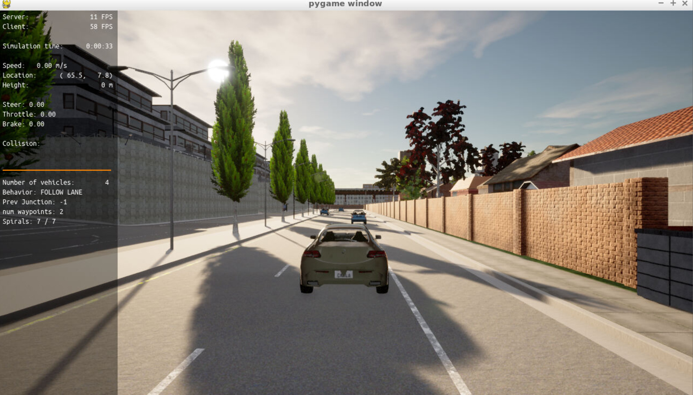

# Code

## Step 1: build the PID controller object
1. The following attributes were declared in pid_controller.h:
``` c++
// Errors
double proportional_part;
double integral_part;
double derivative_part;
double int_cte; // in support of the integral part
double prev_cte; // in support of the derivative part

// Coefficients
double Kp; // proportional gain
double Ki; // integral gain
double Kd; // derivative gain

// Output limits
double output_lim_min;
double output_lim_max;

// Delta time
double delta_time;
```

2. The Init function was defined in pid_controller.cpp as follows:
```c++
void PID::Init(double Kpi, double Kii, double Kdi, double output_lim_maxi, double output_lim_mini) {
   // TODO: Initialize PID coefficients (and errors, if needed)
   Kp = Kpi;
   Ki = Kii;
   Kd = Kdi;
   output_lim_max = output_lim_maxi;
   output_lim_min = output_lim_mini;
   prev_cte = 0.0; // Initialize as zero
   int_cte = 0.0; // Initialize as zero
}
```

3. The UpdateError function was defined in pid_controller.cpp as follows:
``` c++
void PID::UpdateError(double cte) {
   // TODO: Update PID errors based on cte.
   
   // Calculate proportional part of control
   proportional_part = -Kp * cte;

   // Calculate integral part of control
   int_cte = int_cte + cte * delta_time;
   integral_part = -Ki * int_cte;

   // Calculate derivative part of control
   derivative_part = -Kd * (cte - prev_cte) / delta_time; 
   prev_cte = cte;
}
```

4. Finally, the TotalError function was defined (and bounded) in pid_controller.cpp as follows:
``` c++
double PID::TotalError() {
   // TODO: Calculate and return the total error
   double control;
   control = proportional_part + integral_part + derivative_part;

   // Limit control value (if necessary)  
   if (control > output_lim_max) {
      control = output_lim_max;
   }
   else if (control < output_lim_min) {
      control = output_lim_min;
   }
   
   return control;
}
```
After compiling, then running the code, the Carla simulator shows a stationary car. 


## Step 2: PID controller for throttle
1. The PID controller for throttle was initiated in main.cpp as follows:
``` c++
PID pid_throttle = PID();
pid_throttle.Init(0.2, 0.001, 0.1, 1.0, -1.0); // Values taken from https://knowledge.udacity.com/questions/852973
```

2. The velocity error (error_throttle) to feed into PID controller was computed in main.cpp as follows:
```c++
////////////////////////////////////////
// Throttle control
////////////////////////////////////////
// Update the delta time with the previous command
pid_throttle.UpdateDeltaTime(new_delta_time);

// Compute error of speed
double error_throttle;
double target_velocity = v_points.back();
error_throttle = velocity - target_velocity; // This will trigger throttle if velocity is too low, brake if velocity is too high
```
I.e. a velocity that is higher than the target velocity will result in a positive error, and a velocity that is lower than the target velocity will result in a negative error.

3. Next, the throttle response was computed in main.cpp as follows:
``` c++
// Compute control to apply
double throttle_output;
double brake_output;
pid_throttle.UpdateError(error_throttle);
double throttle = pid_throttle.TotalError();
```
I.e. given the negative sign in front of each of the PID coefficients, a positive error (velocity exceeding the target velocity) will result in a negative throttle output value. Instead, a negative error (velocity lower than the target velocity) will result in a positive throttle output value.

4. Finally, the sign of the computed throttle output is used to determine if the output should be interpreted as a true 'throttle' command, or a 'brake' command instead. 
``` c++
// Adapt the negative throttle to break
if (throttle > 0.0) {
   throttle_output = throttle;
   brake_output = 0.0;
} else {
   throttle_output = 0.0;
   brake_output = -throttle;
}
```

## Step 3: PID controller for steer
1. The PID controller for steer was initiated in main.cpp as follows:
``` c++
PID pid_steer = PID();
pid_steer.Init(0.3, 0.001, 0.3, 1.2, -1.2); // Values taken from https://knowledge.udacity.com/questions/852973
```

2. The steer error (error_throttle) to feed into PID controller was computed in main.cpp as follows:
```c++
////////////////////////////////////////
// Steering control
////////////////////////////////////////
// Update the delta time with the previous command
pid_steer.UpdateDeltaTime(new_delta_time);

// Compute steer error
// TODO (step 3): Compute the steer error (error_steer) from the position and the desired trajectory
double error_steer;
double current_yaw = yaw;
double target_steer = 0.0;
if( x_points.size() > 1 ) {
   target_steer =  angle_between_points(x_position, y_position, x_points.back(), y_points.back());
   if(velocity < 0.01) {
      target_steer = yaw;
   }
}         
error_steer = current_yaw - target_steer; // This will help align the direction of the response (steer output) with the target
```
I.e. a counterclockwise (positive) current yaw versus a clockwise (negative) target yaw will result in a (large positive error. Instead, a clockwise (negative) current yaw versus a counterclockwise (positive) target yaw will result in a (large) negative error. 

3.  Next, the steer response was computed in main.cpp as follows:
```c++
// Compute control to apply
double steer_output; 
pid_steer.UpdateError(error_steer);
steer_output = pid_steer.TotalError();
```
I.e. given the negative sign in front of each of the PID coefficients, a positive error (counterclockwise yaw versus a clockwise target yaw) will result in a negative (clockwise) steer output value. A negative error will results in a positive (counterclockwise) steer output value.  
Unlike for the throttle response, there is no need to modify the response based on the sign in front of the steer value. 

# Answers to Project Questions

## Step 4: Evaluate the PID efficiency
Coming to a set of PID coefficient values for throttle control only was not too difficult. However, I struggled iterating to a set of PID coefficient values that resulted in an ego vehicle able to prevent (most) collisions. I ended up using the values documented in [this](https://knowledge.udacity.com/questions/852973) post. The results described below were obtained using these coefficient values. A video (of a different run than the one used to generate the graphs below) is available [here](https://github.com/alexheijnen1980/control/tree/main/pid_controller/screenshot).

1. Question: *Add the plots to your report and explain them (describe what you see).*  
   
   **Steer Control**  
   The graph below shows that for the first 100 seconds the control provided by the PID controller results in an average steering (yaw) error of close to 0 radians. However, after the 100 second mark, the magnitude of the control provided by the PID controller sharply increases (to above the [-1.2, 1.2] limits even) and the error increases sharply.  
   

   **Throttle Control**
   The graph below shows a more "well behaved" control provided by the PID controller in charge of throttle response. Values never exceed the [-1.0, 1.0] limits (negative values are made positive before sending a brake command). As expected (and as designed) either a throttle command or a brake command is provided by the PID controller, never both at the same time. Somewhat unexpectedly, the average error is not 0, but has a negative value. This implies that - on average - the actual velocity of the ego vehicle is lower than the target velocity provided by the trajectory planner.  
   

2. Question: *What is the effect of the PID according to the plots, how each part of the PID affects the control command?*
* The proportional part of the PID controller will scale the response of the controller with the magnitude of the Cross Track Error (CTE). By itself (without the other parts of the PID controller) this will result in marginally stable behavior. The ego vehicle will start to oscillate around a (fixed) yaw / velocity target. Increasing the value of the proportional coefficient will make the ego vehicle 'close the gap' to the yaw / velocity target quicker, but will also increase the magnitude of the oscillations around a (fixed) target.
* The derivative part of the PID controller will scale the response of the controller with the magnitude of the rate of change of the CTE. I.e. in case of a reducing CTE, this derivative will be negative and start to counter the response generated by the proportional part of the controller.
* Instead, the integral part of the PID controller will scale the response of the controller with the magnitude of the integral of the CTE over time. This approach can be used to compensate for a systematic bias.

3. Question: *How would you design a way to automatically tune the PID parameters?*
The automated approach that is described in lecture 13 (twiddle, or coordinate ascent) requires use of a measure of goodness that can be associated with a combination of PID coefficients (gains). In case of this particular project (and as referenced in the lecture) this measure of goodness could be the average Cross Track Error over one (or more) specific simulation scenario(s).  

4. Question: *The PID controller is a model free controller, i.e. it does not use a model of the car. Could you explain the pros and cons of this type of controller?*
If found the core of the answer below in [this](https://www.quora.com/What-are-the-advantages-and-disadvantages-of-PID) post on Quora.  
The key benefits of a model free (e.g. PID) controller are the following:
   * they are based on the delta between the desired signal and the controlled signal, and do not require any additional measurements (sensors) of the internal state of the system. This prevents BOM cost due to not needing to add additional sensors for the purpose of implementing a model free controller.
   * they do not require (much) knowledge of the system that is to be controlled. People designing and implementing the controller do not need in depth knowledge of the system. Instead, they can treat the system as a 'black box'. This allows for more people to design and implement a model free controller.      

   One of the main drawbacks of model free controllers, referenced in the Quora post, but also in other sources, is that they tend to perform well in certain operating conditions (especially the ones that were explicitly considered during tuning), but not in all operating conditions. Relating this to the use case of autonomous vehicles, a PID controller to control throttle response that was tuned only to dry conditions, might not perform as desired when confronted with wet or icy conditions.   
      
4. Question: *What would you do to improve the PID controller?*  
While I did not pursue implementing this idea, I did consider (somehow) linking the two controllers. Given that one of the (higher level) objectives is to follow a trajectory, and given that the lateral displacement of the car (within a fixed amount of time) is a function of both the steering angle and of the velocity of the car, it seems important to define a relationship between steering angle and throttle response. This could be achieved by either scaling (limiting) steering angle as a function of throttle control, or by scaling (limiting) throttle response as a function of steer control.